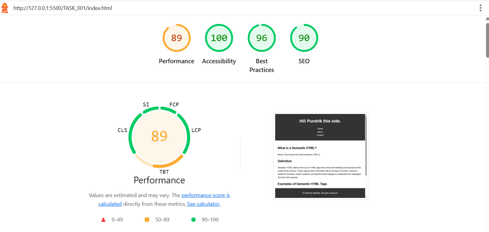

---

## 🧠 Semantic HTML Elements Used

This website makes extensive use of semantic HTML elements to ensure clarity, structure, and accessibility.  

Below are the main semantic elements included in the `index.html` file:

- **`<header>`**: Represents introductory content or a set of navigational links.  
- **`<nav>`**: Defines a section that contains navigation links.  
- **`<main>`**: Specifies the main content of the document.  
- **`<section>`**: Represents a standalone section of content.  
- **`<article>`**: Defines an independent piece of content, such as a blog post or news article.  
- **`<aside>`**: Contains content tangentially related to the main content (e.g., sidebars, callouts).  
- **`<footer>`**: Represents the footer for its nearest sectioning content or sectioning root element.

---

## ♿ Accessibility Enhancements

To make the website more accessible, **ARIA attributes** have been added throughout the HTML files, including:

- `aria-label` – Provides descriptive labels for interactive elements.  
- `role` – Defines the specific role of an element for assistive technologies.  
- `aria-required` – Indicates whether user input is mandatory in forms.  

These enhancements ensure the site is more inclusive for users with assistive technologies like screen readers.

---

## 🌐 Pages Overview

- **Homepage (`index.html`)**: Welcomes visitors and provides navigation to other sections.  
- **About Me (`about.html`)**: Shares information about Me.  
- **Contact (`contact.html`)**: Contains a contact form or communication details.

---

## 🛠️ Technologies Used

- **HTML5** — For semantic, structured markup.  
- **CSS3** — For styling and responsive layout.  

---

## 📈 Lighthouse Performance Score

The project has been tested using **Google Lighthouse** for performance, accessibility, best practices, and SEO.  
Below is the Lighthouse score screenshot:

---

## 📜 License

This project is licensed under the **MIT License**.  
You’re free to use, modify, and distribute it as long as proper credit is given.

